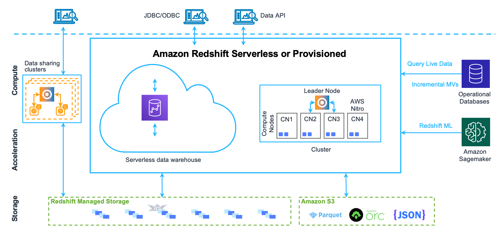

# Redshift
- Amazon Redshift is an enterprise-level, petabyte scale, fully managed data
  warehousing service.

- Amazon Redshift delivers 10 times faster performance than other data
  warehouses.

- It does so by using sophisticated query optimization, columnar storage on
  high-performance local disks, machine learning, and massively parallel
  query execution.

- Amazon Redshift supports client connections with many types of
  applications, including business intelligence (BI), reporting, data, and
  analytics tools.

# Data Warehouse System Architecture

- Explaination https://docs.aws.amazon.com/redshift/latest/dg/c_high_level_system_architecture.html